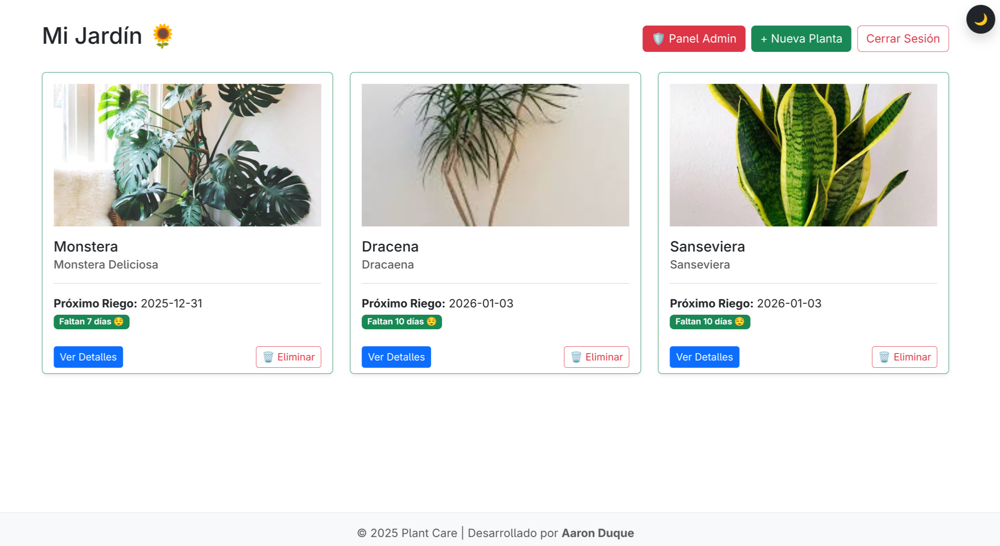
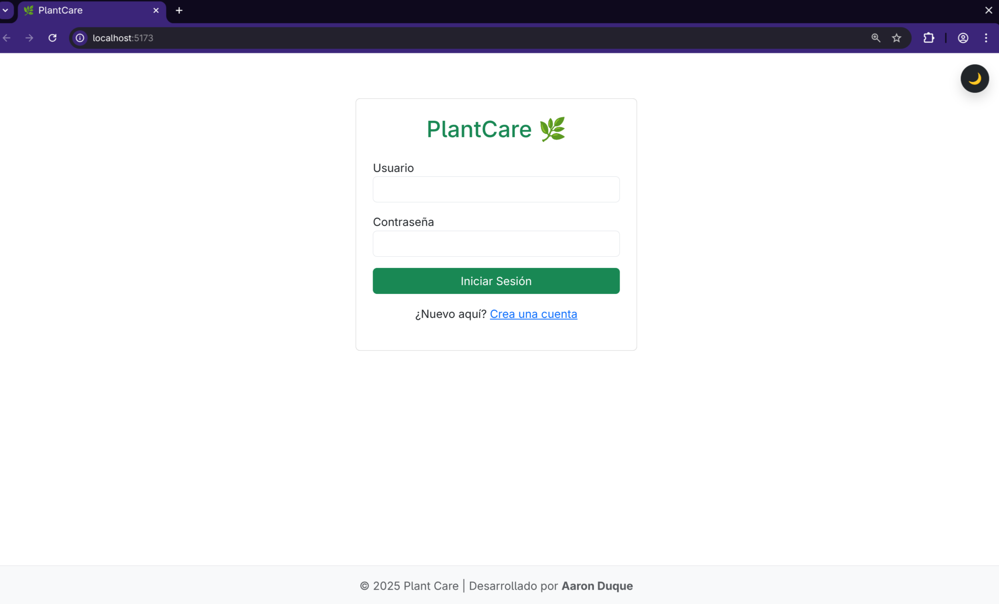
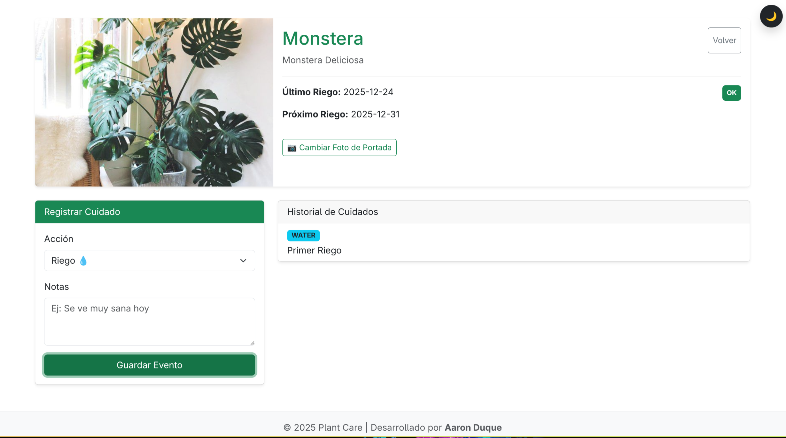

# 🌿 Plant Care

> **Gestión integral para el cuidado y seguimiento de tus plantas.**


*(Aquí puedes poner una captura principal del Dashboard o la Landing Page)*

## 📖 Descripción

**Plant Care** es una aplicación web Full Stack diseñada para ayudar a los usuarios a registrar, monitorear y cuidar sus plantas de manera eficiente. Permite llevar un control detallado de las especies, programar cuidados y mantener un historial de salud de cada planta.

Este proyecto fue desarrollado como parte de un portafolio profesional, demostrando la integración de una arquitectura por capas, seguridad avanzada con **JWT** y una interfaz de usuario reactiva y amigable.

## 🚀 Tecnologías Utilizadas

### Backend (Servidor & API)
- **Java 21**: Lenguaje principal, aprovechando las últimas características de rendimiento.
- **Spring Boot**: Framework para la creación de la API RESTful.
- **Spring Security + JWT**: Autenticación y autorización robusta basada en tokens.
- **Spring Data JPA (Hibernate)**: Persistencia y mapeo objeto-relacional (ORM).
- **MySQL**: Base de datos relacional.
- **OpenAPI / Swagger UI**: Documentación interactiva de la API.
- **Maven**: Gestión de dependencias y construcción.

### Frontend (Cliente Web)
- **React 19**: Biblioteca de UI para interfaces dinámicas.
- **Vite**: Empaquetador de próxima generación para un desarrollo ultra rápido.
- **React Router v7**: Enrutamiento declarativo.
- **Bootstrap 5**: Estilizado responsivo y componentes modernos.
- **Axios**: Cliente HTTP para la comunicación con el backend.

---

## ✨ Características Principales

### 🔐 Seguridad y Autenticación
- Registro e inicio de sesión seguro.
- Protección de rutas basada en roles (Admin vs Usuario).
- Tokens JWT para sesiones stateless.

### 🌱 Gestión de Plantas
- **CRUD Completo**: Crear, leer, actualizar y eliminar plantas de tu colección.
- **Catálogo de Especies**: Información detallada sobre tipos de plantas y sus necesidades.
- **Estados de Salud**: Monitoreo del estado vital (Saludable, Enferma, En recuperación).

### 📅 Bitácora de Cuidados (Care Logs)
- Registro de actividades: Riego, fertilización, poda, trasplante.
- Historial detallado por planta.

### 🛠 Panel de Administración
- Gestión centralizada de usuarios y especies (solo para rol ADMIN).

---

## 📸 Galería de Interfaz

| Login | Dashboard | Detalles de Planta |
|-------|-----------|--------------------|
|  |  |  |
*(Reemplaza estas rutas con tus imágenes reales en la carpeta uploads)*

---

## 🔧 Instalación y Configuración

Sigue estos pasos para replicar el proyecto en tu entorno local.

### Prerrequisitos
- **Java JDK 21** instalado.
- **Node.js** (v18 o superior) y **npm**.
- **MySQL** Server ejecutándose.

### 1. Configuración de Base de Datos
Crea una base de datos vacía en MySQL. El backend se encargará de crear las tablas automáticamente.

```sql
CREATE DATABASE my_plant_care_db;
```

Asegúrate de que tu usuario sea `root` y la contraseña esté vacía (o actualiza el archivo `backend/src/main/resources/application.properties` con tus credenciales).

### 2. Ejecutar el Backend
Navega a la carpeta del servidor e inicia la aplicación Spring Boot.

```bash
cd backend
./mvnw spring-boot:run
```
*El servidor iniciará en `http://localhost:8080`*

### 3. Ejecutar el Frontend
En una nueva terminal, navega a la carpeta del cliente, instala las dependencias e inicia el servidor de desarrollo.

```bash
cd frontend
npm install
npm run dev
```
*La aplicación web estará disponible generalmente en `http://localhost:5173`*

---

## 📚 Documentación de API

El proyecto incluye documentación automática generada con Swagger. Una vez que el backend esté corriendo, puedes explorar y probar los endpoints directamente en tu navegador:

🔗 **Swagger UI:** [http://localhost:8080/swagger-ui.html](http://localhost:8080/swagger-ui.html)

### Endpoints Principales

#### Autenticación (`/api/auth`)
*   `POST /signin`: Iniciar sesión (Devuelve JWT).
*   `POST /signup`: Registrar nuevo usuario.

#### Plantas (`/api/plants`)
*   `GET /`: Obtener todas las plantas del usuario autenticado.
*   `POST /`: Registrar una nueva planta.
*   `GET /{id}`: Obtener detalles de una planta específica.
*   `DELETE /{id}`: Eliminar una planta.

*Nota: La mayoría de endpoints requieren el header `Authorization: Bearer <TOKEN>`.*

---

## 👤 Autor

**Aaron Duque**
- 📧 Email: duqueaaron022006@gmail.com
- 💼 [LinkedIn](https://www.linkedin.com/in/aaron-duque-aa41b3370/) 

---
*Este proyecto es de código abierto y está disponible para fines educativos y de demostración.*
